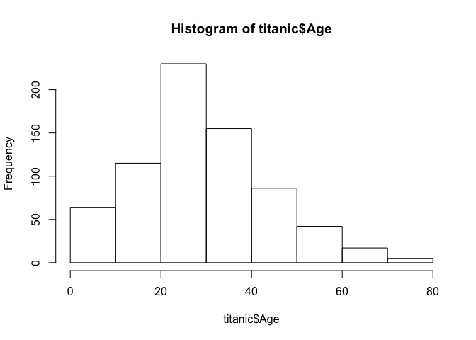
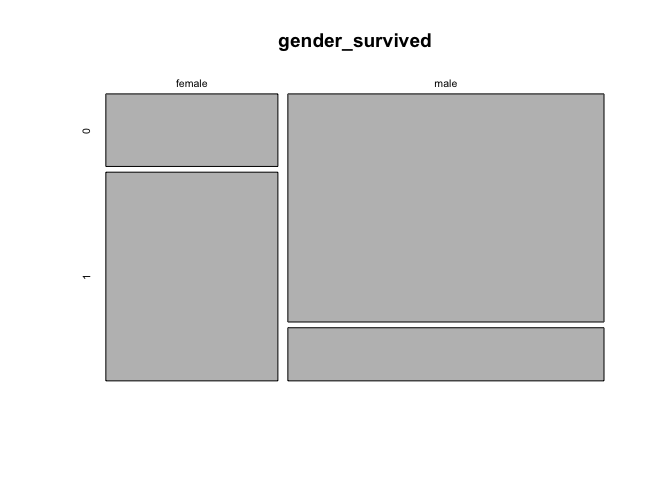
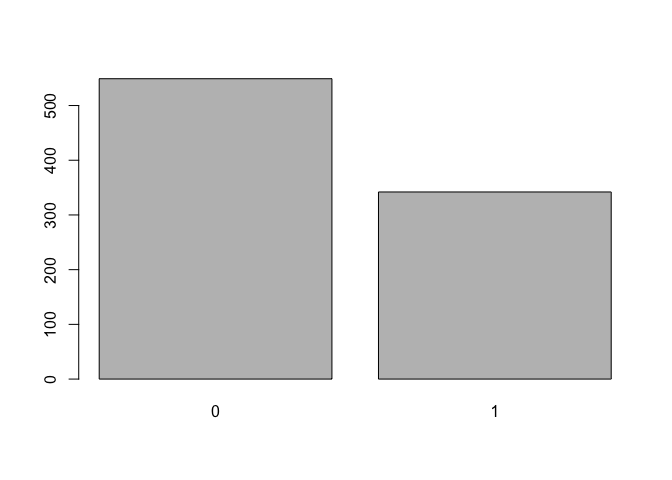
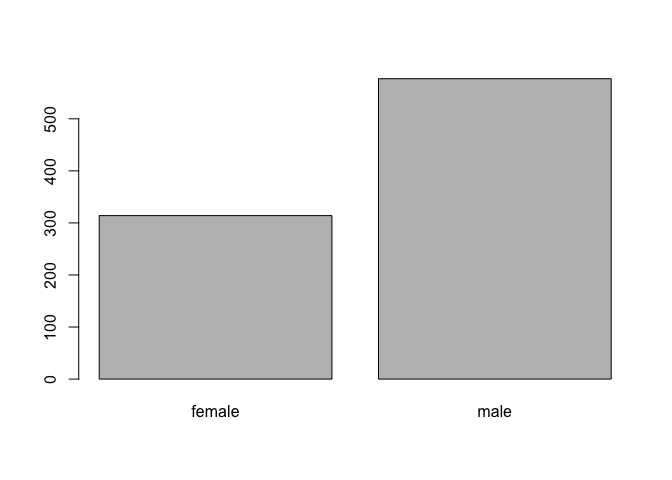
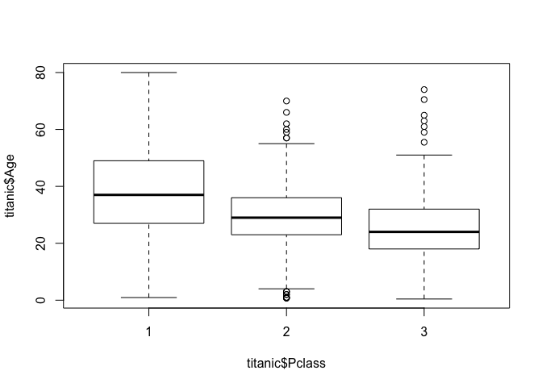
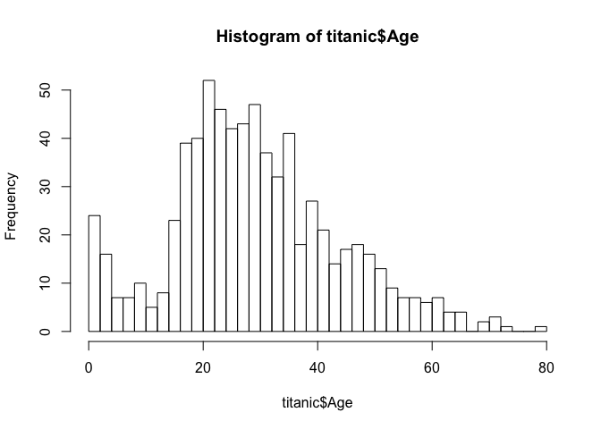

    #setwd("/Users/Home/Desktop/St Thomas/SEIS 631")

<figure>
<figcaption aria-hidden="true">Titanic Ship</figcaption>
</figure>

    library(readr);
    Titanic <- read_csv("titanic.csv")

    ## Parsed with column specification:
    ## cols(
    ##   PassengerId = col_double(),
    ##   Survived = col_double(),
    ##   Pclass = col_double(),
    ##   Name = col_character(),
    ##   Sex = col_character(),
    ##   Age = col_double(),
    ##   SibSp = col_double(),
    ##   Parch = col_double(),
    ##   Ticket = col_character(),
    ##   Fare = col_double(),
    ##   Cabin = col_character(),
    ##   Embarked = col_character()
    ## )

## References:

### 1. [Titanic Picture](https://en.wikipedia.org/wiki/Titanic)

### 2. [SEIS-631 HW-3](https://stthomas.edu)

### 3. Dataset \[<https://github.com/elisabetta42/dataset_analysis/blob/master/titanic3.csv>\]

### 4. \[<https://ggplot2.tidyverse.org>\]

(<https://github.com/Adam-1792/631-rtopics>)

<https://github.com/Adam-1792/Adnan_Suri---631-Final-Project/blob/main/.gitignore>

# Introduction

## WHAT: Since I watched the Titanic movie in 1997, I have always wanted to learn more statistical status of the Titanic ship. I hypothesize that more males died vs. females during the event. Also, I would like to know the survival age range and perform further statistical analysis to compare the data, like the overall survival rate.

## WHY: It is unfortunate that the Titanic ship sank and people died. People created a dataset to understand statistics and mainly apply those statistics for people’s safety and a better world, which is very similar to the Covid dataset. Because of my interest in Titanic, I will use R language to learn more about titanic data.

## HOW: My goal would be to visualize the data by using tidyverse for titanic data manipulation and visualization. I will be doing the data analysis by using the following:

## MINIMAL: My goal would be to get more familiar with R, import titanic dataset into R, runs statistics using R functionality, especially ggplot, tidyvers, visuals where I can run the data with graphs, charts formats, and write the report in R Markdown and export in PDF.

## AMBITIOUS: My next stretch goal would be to add more visuals and importing the dataset into Power BI ( <https://docs.microsoft.com/en-us/power-bi/connect-data/desktop-r-scripts>). Installing R script into BI desktop and create “Titanic Dashboard” to run different visuals with slicer option.

# Topics From Class

### Topic 1: Lecture 8: Tidy Data a.k.a Tidyverse approach to R.

    ## 1) Use R functionality to analyze the data using ggplot 2 (data visualization)
    ## 2) R functionality dplyr (data manipulation)
    ## 3) R funtionality tidyr (data cleaning)

### Topic 2: Chapter 2, Summarizing the data.

    ## 1) Examine the numerical data using scatterplot, histogram, standard deviation, boxplot, quaterlies and median. 
    ## 2) Analyze data by considering categorical data;
          tables and barplots - class Hw-3 
        

### Topic 3: Distribution of random variables try with R

    ## 1) Normal distribution - plot(x, qnorm(x))
    ## 2) Geometric distribution - plot(x, gnorm(x))
    ## 3) Binomial distribution - plot(x, bnorm(x))
    ## 4) Negative binomial distribution - plot(x, pnorm(x))

### Topic 4: Introduction to linear regression try with R

    ## 1) Understand Titanic data and define the correlation
    ## 2) Draw different residual plots and analyse the data

### Topic 5: R Shinny app

    ## 1) If time permits than will create a dashboard using R Shinny app
    ## 2) Analyze the data and visualization

     ********************************************************************************************

#### Topic 2: Chapter 2, Summarizing the data

There are 891 observations and 12 variables. It is a tibble: 891 x 12
with 7 <dbl> - hold the numeric values with decimal points and 5 <chr>

    titanic <- read.table('titanic.csv',header = TRUE, sep = ",")
    summary(titanic)

    ##   PassengerId       Survived          Pclass     
    ##  Min.   :  1.0   Min.   :0.0000   Min.   :1.000  
    ##  1st Qu.:223.5   1st Qu.:0.0000   1st Qu.:2.000  
    ##  Median :446.0   Median :0.0000   Median :3.000  
    ##  Mean   :446.0   Mean   :0.3838   Mean   :2.309  
    ##  3rd Qu.:668.5   3rd Qu.:1.0000   3rd Qu.:3.000  
    ##  Max.   :891.0   Max.   :1.0000   Max.   :3.000  
    ##                                                  
    ##                                     Name    
    ##  Abbing, Mr. Anthony                  :  1  
    ##  Abbott, Mr. Rossmore Edward          :  1  
    ##  Abbott, Mrs. Stanton (Rosa Hunt)     :  1  
    ##  Abelson, Mr. Samuel                  :  1  
    ##  Abelson, Mrs. Samuel (Hannah Wizosky):  1  
    ##  Adahl, Mr. Mauritz Nils Martin       :  1  
    ##  (Other)                              :885  
    ##      Sex           Age            SibSp      
    ##  female:314   Min.   : 0.42   Min.   :0.000  
    ##  male  :577   1st Qu.:20.12   1st Qu.:0.000  
    ##               Median :28.00   Median :0.000  
    ##               Mean   :29.70   Mean   :0.523  
    ##               3rd Qu.:38.00   3rd Qu.:1.000  
    ##               Max.   :80.00   Max.   :8.000  
    ##               NA's   :177                    
    ##      Parch             Ticket         Fare       
    ##  Min.   :0.0000   1601    :  7   Min.   :  0.00  
    ##  1st Qu.:0.0000   347082  :  7   1st Qu.:  7.91  
    ##  Median :0.0000   CA. 2343:  7   Median : 14.45  
    ##  Mean   :0.3816   3101295 :  6   Mean   : 32.20  
    ##  3rd Qu.:0.0000   347088  :  6   3rd Qu.: 31.00  
    ##  Max.   :6.0000   CA 2144 :  6   Max.   :512.33  
    ##                   (Other) :852                   
    ##          Cabin     Embarked
    ##             :687    :  2   
    ##  B96 B98    :  4   C:168   
    ##  C23 C25 C27:  4   Q: 77   
    ##  G6         :  4   S:644   
    ##  C22 C26    :  3           
    ##  D          :  3           
    ##  (Other)    :186

    dim(titanic)

    ## [1] 891  12

    length(dim(titanic))

    ## [1] 2

    names(titanic)

    ##  [1] "PassengerId" "Survived"    "Pclass"     
    ##  [4] "Name"        "Sex"         "Age"        
    ##  [7] "SibSp"       "Parch"       "Ticket"     
    ## [10] "Fare"        "Cabin"       "Embarked"

    plot(hist(titanic$Age))

    head(titanic)

    ##   PassengerId Survived Pclass
    ## 1           1        0      3
    ## 2           2        1      1
    ## 3           3        1      3
    ## 4           4        1      1
    ## 5           5        0      3
    ## 6           6        0      3
    ##                                                  Name
    ## 1                             Braund, Mr. Owen Harris
    ## 2 Cumings, Mrs. John Bradley (Florence Briggs Thayer)
    ## 3                              Heikkinen, Miss. Laina
    ## 4        Futrelle, Mrs. Jacques Heath (Lily May Peel)
    ## 5                            Allen, Mr. William Henry
    ## 6                                    Moran, Mr. James
    ##      Sex Age SibSp Parch           Ticket    Fare
    ## 1   male  22     1     0        A/5 21171  7.2500
    ## 2 female  38     1     0         PC 17599 71.2833
    ## 3 female  26     0     0 STON/O2. 3101282  7.9250
    ## 4 female  35     1     0           113803 53.1000
    ## 5   male  35     0     0           373450  8.0500
    ## 6   male  NA     0     0           330877  8.4583
    ##   Cabin Embarked
    ## 1              S
    ## 2   C85        C
    ## 3              S
    ## 4  C123        S
    ## 5              S
    ## 6              Q

    tail(titanic)

    ##     PassengerId Survived Pclass
    ## 886         886        0      3
    ## 887         887        0      2
    ## 888         888        1      1
    ## 889         889        0      3
    ## 890         890        1      1
    ## 891         891        0      3
    ##                                         Name    Sex
    ## 886     Rice, Mrs. William (Margaret Norton) female
    ## 887                    Montvila, Rev. Juozas   male
    ## 888             Graham, Miss. Margaret Edith female
    ## 889 Johnston, Miss. Catherine Helen "Carrie" female
    ## 890                    Behr, Mr. Karl Howell   male
    ## 891                      Dooley, Mr. Patrick   male
    ##     Age SibSp Parch     Ticket   Fare Cabin
    ## 886  39     0     5     382652 29.125      
    ## 887  27     0     0     211536 13.000      
    ## 888  19     0     0     112053 30.000   B42
    ## 889  NA     1     2 W./C. 6607 23.450      
    ## 890  26     0     0     111369 30.000  C148
    ## 891  32     0     0     370376  7.750      
    ##     Embarked
    ## 886        Q
    ## 887        S
    ## 888        S
    ## 889        S
    ## 890        C
    ## 891        Q

    summary.data.frame(titanic)

    ##   PassengerId       Survived          Pclass     
    ##  Min.   :  1.0   Min.   :0.0000   Min.   :1.000  
    ##  1st Qu.:223.5   1st Qu.:0.0000   1st Qu.:2.000  
    ##  Median :446.0   Median :0.0000   Median :3.000  
    ##  Mean   :446.0   Mean   :0.3838   Mean   :2.309  
    ##  3rd Qu.:668.5   3rd Qu.:1.0000   3rd Qu.:3.000  
    ##  Max.   :891.0   Max.   :1.0000   Max.   :3.000  
    ##                                                  
    ##                                     Name    
    ##  Abbing, Mr. Anthony                  :  1  
    ##  Abbott, Mr. Rossmore Edward          :  1  
    ##  Abbott, Mrs. Stanton (Rosa Hunt)     :  1  
    ##  Abelson, Mr. Samuel                  :  1  
    ##  Abelson, Mrs. Samuel (Hannah Wizosky):  1  
    ##  Adahl, Mr. Mauritz Nils Martin       :  1  
    ##  (Other)                              :885  
    ##      Sex           Age            SibSp      
    ##  female:314   Min.   : 0.42   Min.   :0.000  
    ##  male  :577   1st Qu.:20.12   1st Qu.:0.000  
    ##               Median :28.00   Median :0.000  
    ##               Mean   :29.70   Mean   :0.523  
    ##               3rd Qu.:38.00   3rd Qu.:1.000  
    ##               Max.   :80.00   Max.   :8.000  
    ##               NA's   :177                    
    ##      Parch             Ticket         Fare       
    ##  Min.   :0.0000   1601    :  7   Min.   :  0.00  
    ##  1st Qu.:0.0000   347082  :  7   1st Qu.:  7.91  
    ##  Median :0.0000   CA. 2343:  7   Median : 14.45  
    ##  Mean   :0.3816   3101295 :  6   Mean   : 32.20  
    ##  3rd Qu.:0.0000   347088  :  6   3rd Qu.: 31.00  
    ##  Max.   :6.0000   CA 2144 :  6   Max.   :512.33  
    ##                   (Other) :852                   
    ##          Cabin     Embarked
    ##             :687    :  2   
    ##  B96 B98    :  4   C:168   
    ##  C23 C25 C27:  4   Q: 77   
    ##  G6         :  4   S:644   
    ##  C22 C26    :  3           
    ##  D          :  3           
    ##  (Other)    :186

    summary(titanic$Age)

    ##    Min. 1st Qu.  Median    Mean 3rd Qu.    Max. 
    ##    0.42   20.12   28.00   29.70   38.00   80.00 
    ##    NA's 
    ##     177

    table(titanic$Survived)

    ## 
    ##   0   1 
    ## 549 342

    table(titanic$Sex)

    ## 
    ## female   male 
    ##    314    577

    table(titanic$Pclass)

    ## 
    ##   1   2   3 
    ## 216 184 491

    table(titanic$Pclass) ->pclass 
    prop.table(pclass)*100

    ## 
    ##        1        2        3 
    ## 24.24242 20.65095 55.10662

    round(pclass, digits=1) ->pclass
    pclass

    ## 
    ##   1   2   3 
    ## 216 184 491

    gender_survived <- table(titanic$Sex, titanic$Survived)
    mosaicplot(gender_survived)

    barplot(table(titanic$Survived))

    barplot(table(titanic$Sex))

    boxplot(titanic$Age ~ titanic$Pclass)

    hist(titanic$Age, breaks = 50)

# Conclusion
